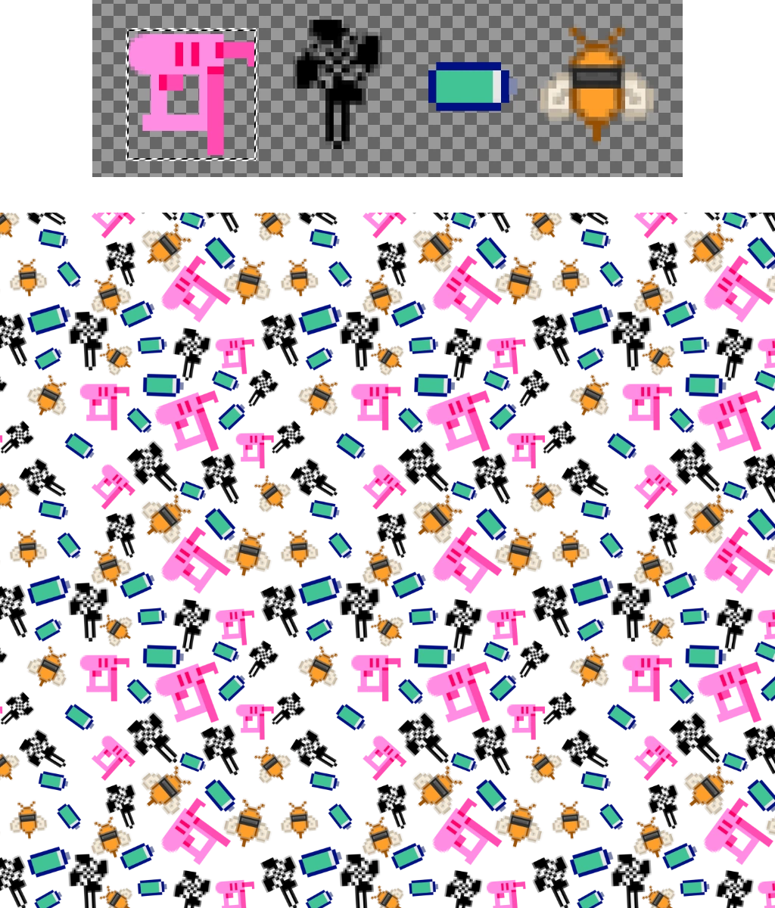
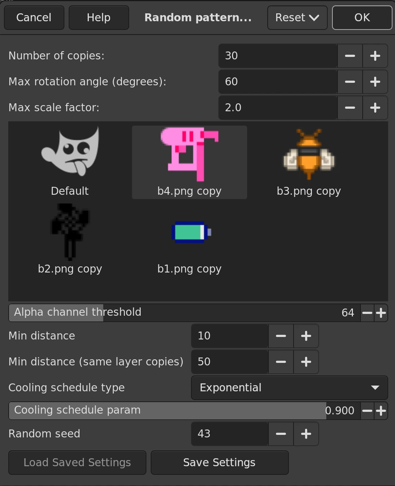

# Random Seamless Pattern Texture Generation Plugin for GIMP 3

### Usage

First, place your figures on the canvas and resize it to the desired dimensions.
Then choose **Filters → Artistic → Random Pattern…**

### Installation

1. Download the archive for your OS from the [releases section](https://github.com/nouveau-nvc0/genpattern-gimp/releases).
2. Unpack it into your **plug-ins** directory.
   You can find that folder via **Edit → Preferences → Folders → Plug-ins**.
